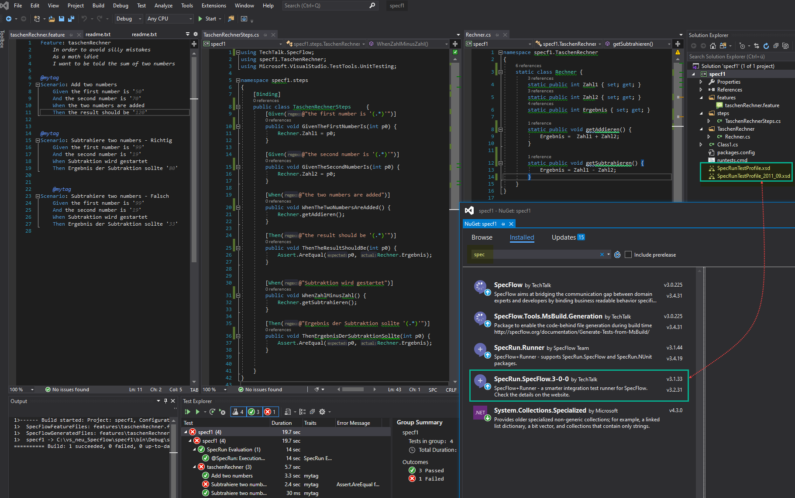

## specFlow

### *PuppeteerSharp* demo mit http://samples.gwtproject.org/samples/Showcase/Showcase.html
#### a) click Radio-btn b) Add/Del rows c) Click Check-Box 

---
### *einfacher Taschenrechner*

<a href="Report_2020-10-31.html">Report</a> 

 
